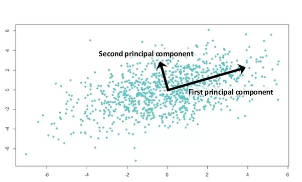

Principal Component Analysis:

Let me introduce some facts:
We have a dataset called the iris dataset which contains measurements of
flowers of a plant called iris. There are three species of flower's this plant produces which are called setosa, viriginica and versicolor

Also we have petal length, petal width, sepal length and width of these flowers. Every flower has 4 features PL,PW,SL,SW. So our dataset is a four dimension dataset, We will use PCA to reduce this to 2d set so that we can visualize them. Data visulaisation is a whole topic on its own

PCA is one of those dimensionality techniques which can be used to reduce to higher dimension data to lower dimension such that its easy to work with them. It is also the simplese dimensionality reduction technique

### TWO SUBTOPICS OF PCA

#### VARIANCE MAXIMATION TECHNIQUE:
This is the variance maximation technique of PCA. Our main goal is the maximize the variance.

How do we do it??

The basic idea is to moving in a direction such that we will cover maximum points and thereby we will achieve variance

Assume if we rotate our x axis we will reach xdash and if we move in xdash direction we can cover the maximum variance. So we start by considering a unit vector in the direction of x dash axis(length of unit vector is one)

We will project every point on unit vector on the x dash axis so as the maximize variance
So the porjection of anypoint xi on the xdash is equal to
xi X xdash / ||xdash|| . In our case we are projecting the point on the unit vector so the length of xdash is 1.
projection of anypoint on unit vector is xi.transporse X x as the in dot product we multiply and take sum of the multiples which is same as matrix multiplication and moreover we will only matmul a row vector and a column vector since here both of them are x we are using xT and x

So variance is basically square(current- mean)

We will take the mean values of xi in here and calculate variance for all xi's in the plot and since we have already column standardised this data which is also called mean centering for managing the data in a better way
Our mean will be 0 and stddev will be 1, In all our variance calculations our second term will be zero and will be left with square(xi). Our task is the find the unit vector such that we cover the maximum variance

#### DISTANCE MINIMIZING TECHNIQUE
As the name suggests, After moving our x axis to xdash axis, We start plotting our points on to xdash axis and we all know that there is some distance between every point and the plane. In this technique, we will try to minimize that distance. Our aim is to reduce the sum of squared difference between each point and the direction of unit vector

Step of working:

1. column standardise the data i.e mean centering of data. If we column standardise our data our data looks clean on graph and moreover this technique is recommend by machine learning community as many model tends to work better after performing this and also we can leverage the power of linear algebra for our computations

2. Make a covariance matrix which is (xtranspose X x)/n

3. Then eigen decomposition on the covariance matrix such that we get values and vectors for all the dimensions, we can also choose the selective number of dimension as per your need

4. every datapoint is multiplied with these vectors such that we get first principal and second principal axis if we are looking for a 2d reduction
